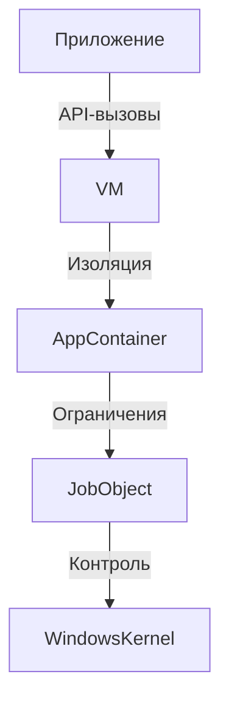

```markdown
# Orby VM для Windows

**Orby VM** — изолированная среда выполнения Python-приложений для Windows. Запускает `.orby` пакеты с контролем доступа к системным ресурсам через механизмы Windows Sandbox.

## Ключевые возможности

- **AppContainer-изоляция** каждого приложения  
- **Виртуальная файловая система** с перенаправлением записей  
- **Контроль разрешений** через Mandatory Integrity Control  
- **Блокировка опасных API** (WinExec, ShellExecute)  
- **Ограничение ресурсов** через Job Objects  

## Быстрый старт

### Установка
```powershell
pip install orby-vm-windows
```

### Запуск приложения
```cmd
orbyvm run app.orby
```

## Команды CLI

| Команда | Описание |
|---------|----------|
| `run <путь>` | Запустить .orby-пакет |
| `ps` | Список запущенных приложений |
| `stop <ID>` | Остановить приложение |
| `perms <ID>` | Управление разрешениями |
| `logs <ID>` | Просмотр логов |

## Архитектура



## Структура изоляции

```
%LOCALAPPDATA%\OrbyVM\
├── Apps\              # Установленные приложения  
│   └── <AppID>\       # Директория приложения
├── VFS\               # Виртуальная ФС  
│   └── <AppID>.db     # SQLite с файлами
├── Logs\              # Логи выполнения
└── Packages\          # Локальные зависимости
```


## Системные требования

- Windows 10+ (сборка 19041+)  
- Python 3.10+ 

## Ограничения

- Доступ к GPU требует ручного подтверждения  
- Сетевые фильтры не блокируют localhost  
- Для USB-устройств нужен драйвер-фильтр  
